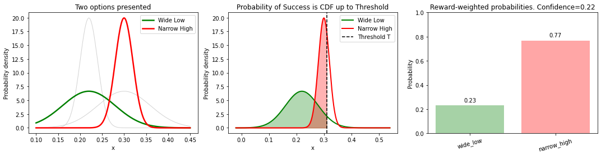

# Claw Machine Experiment Data Modelling
Modelling claw machine experiment data using Optimal Bayesian decision-making agent. Confidence is given 
by the entropy of the Gibb's posterior.

* Each category is a univariate Gaussian N(μ, σ).
* On a trial the agent is offered two categories and must **choose which one to sample from**.
* An outcome is a **success** if the draw is below a fixed threshold \(T\), otherwise a failure.
* Rewards can differ between categories and are applied on success only.
* The agent maximises **expected exponential utility**

In __main__ section of decision_maker.py:

    - Adjust parameters of the ball distributions via "cats" dictionary
    - Adjust rewards of the ball distributions via "rews" dictionary
    - Provide pairs to evaluate via list of tuples called "pairs"
    - When initialising the agent we need:
        - Threshold, T
        - Inverse temperature parameter, β
        - Decision-rule flag: if soft = False, then we do a MAP decision rule, otherwise soft sampling of the catgeory

* `soft=True` makes the agent **sample** from the posterior over actions.  
  Set `soft=False` for the deterministic MAP choice.
  Adjust β parameter to adjust risk sensitivity of agent

* `confidence` is the **negative entropy** of that posterior (larger = more confident).